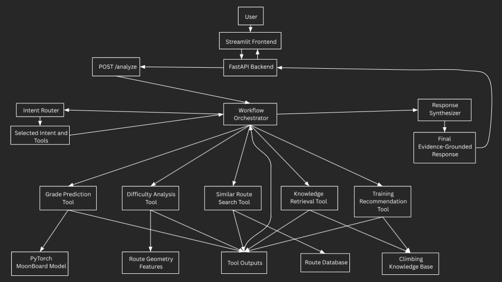

# CruxAI

CruxAI is an AI-powered climbing analysis system for MoonBoard routes. It combines a PyTorch grade-prediction model, retrieval-augmented generation, tool routing, multi-step orchestration, FastAPI, Streamlit, and an evaluation dashboard.

A user can ask a climbing question, request a training plan, or submit an 18 × 11 MoonBoard route for grade prediction and difficulty analysis.

## Key Features

- PyTorch MoonBoard grade-prediction model
- Interactive 18 × 11 MoonBoard route builder
- FastAPI backend
- Streamlit frontend
- Multi-tool routing and orchestration
- Retrieval over a climbing knowledge base
- Evidence-grounded training recommendations
- Similar-route retrieval
- Route difficulty analysis
- Evaluation dashboard
- Docker deployment
- Automated testing with pytest

## System Architecture



CruxAI uses a workflow orchestrator to coordinate routing, tool execution, intermediate results, and final response generation.

The high-level request flow is:

1. A user submits a request through the Streamlit frontend.
2. The frontend sends the request to the FastAPI `/analyze` endpoint.
3. The workflow orchestrator sends the request to the intent router.
4. The router selects one or more tools.
5. The orchestrator executes the selected tools.
6. Tool outputs are collected and passed to the response synthesizer.
7. The final evidence-grounded response is returned to the user.

## CruxAI Tools

CruxAI currently includes five tools.

### Grade Prediction

Predicts the difficulty of an 18 × 11 MoonBoard route using a trained PyTorch multilayer perceptron.

Returns:

- raw predicted grade
- rounded grade
- formatted V-grade
- model version

### Difficulty Analysis

Calculates geometric characteristics of a route, including:

- number of holds
- vertical span
- horizontal span
- average move distance
- maximum move distance
- board coverage
- likely difficulty factors

### Similar Route Search

Uses route representations and retrieval to find MoonBoard routes that resemble the submitted route.

### Knowledge Retrieval

Retrieves relevant climbing information from the project knowledge base.

Example topics include:

- body tension
- overhang technique
- route reading
- power endurance
- movement efficiency

### Training Recommendation

Combines climber context, route difficulty factors, and retrieved evidence to generate a structured training recommendation.

The CPU deployment uses deterministic evidence synthesis for fast, grounded responses. Local development can still use the language-model generation path.

## Technology Stack

### Machine Learning

- PyTorch
- NumPy
- Sentence Transformers
- Transformers

### Backend

- FastAPI
- Pydantic
- Uvicorn

### Frontend

- Streamlit
- Requests
- Pandas

### Evaluation

- pytest
- custom router evaluations
- retrieval ablations
- prompt evaluations
- latency benchmarking

### Deployment

- Docker
- Docker Compose planned
- environment-variable configuration

## Repository Structure

```text
CruxAI/
├── app/
│   ├── main.py
│   ├── generation/
│   ├── orchestration/
│   ├── retrieval/
│   ├── routing/
│   └── tools/
├── data/
├── docs/
│   └── cruxai_architecture.png
├── evaluation/
│   ├── results/
│   └── evaluation scripts
├── frontend/
│   ├── app.py
│   └── pages/
│       └── 1_Evaluation_Dashboard.py
├── models/
├── tests/
├── Dockerfile
├── requirements.txt
├── requirements-dev.txt
└── README.md